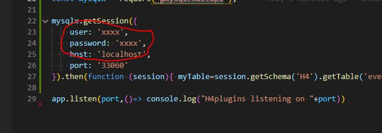

# NodeJS / express server for MySQL logging
## Version 0.1.0

Enables [H4Plugins library](https://github.com/philbowles/h4plugins) to log events to an external MySQL server. See the [example sketch](LINK T.B.A)

---

## What does it do?

The code opens an http port on 8266 and services POST requests in `application/x-www-form-urlencoded` format. It expects a MySQL schema called `h4` with a table `event` with the following DDL:

```sql
CREATE TABLE `event` (
  `id` int NOT NULL AUTO_INCREMENT,
  `ts` timestamp NOT NULL DEFAULT CURRENT_TIMESTAMP,
  `device` varchar(16) NOT NULL,
  `type` int NOT NULL,
  `source` varchar(16) DEFAULT NULL,
  `msg` varchar(128) DEFAULT NULL,
  PRIMARY KEY (`id`),
  UNIQUE KEY `id_UNIQUE` (`id`)
) ENGINE=InnoDB AUTO_INCREMENT=10856 DEFAULT CHARSET=utf8mb4 COLLATE=utf8mb4_0900_ai_ci
```

The POST body must contain data for the following fields:

* `device`
* `type`
* `source`
* `msg`

## Prerequites
 
A server running

* MySQL configured for remote access
* NodeJS 
* express

## Installation

Installation of a suitable OS and the above packages is beyond the scope of this document.

1. Create a database named h4 in MySQL
2. Create the schema shown above
3. Install the nodejs package [@mysql/xdevapi](https://www.npmjs.com/package/@mysql/xdevapi)
4. Edit h4.js and replace the XXXXs with your MySQL username and password 
5. Ensure your firewall allows inbound HTTP on port 8266
6. Start the server with `node h4`
7. Run the [H4P_RemoteLogger example]( LINK tba) after editing the url with the domain name or IP address of your server 
   
---

(c) 2021 Phil Bowles h4plugins@gmail.com

* [Facebook H4  Support / Discussion](https://www.facebook.com/groups/444344099599131/)
* [Facebook General ESP8266 / ESP32](https://www.facebook.com/groups/2125820374390340/)
* [Facebook ESP8266 Programming Questions](https://www.facebook.com/groups/esp8266questions/)
* [Facebook IOT with ESP8266 (moderator)](https://www.facebook.com/groups/1591467384241011/)
* [Facebook ESP Developers (moderator)](https://www.facebook.com/groups/ESP8266/)
* [Support me on Patreon](https://patreon.com/esparto)om/esparto)